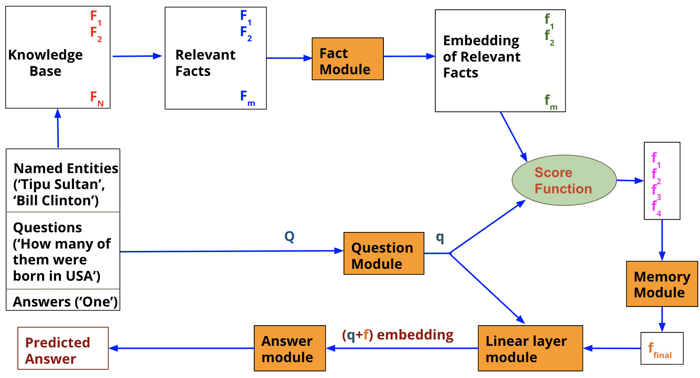

# Project E1 246: Natural Language Understanding
* The code contains Pytorch implementation of knowledge-based visual question answering system.

## Architecture

### Modules
* Fact module
* Question module
* Memory module
* Linear Layer module
* Answer module
## Prerequistes
* Pytorch
* numpy
* pickle
* codecs
* sklearn
* easy to execute the entire code in google colab

## Dataset
* Preprocessed KG facts (http://malllabiisc.github.io/resources/kvqa/)

*  Dataset (http://dosa.cds.iisc.ac.in/kvqa/dataset.json)
## Procedure
* It is advised to use google colab. 

